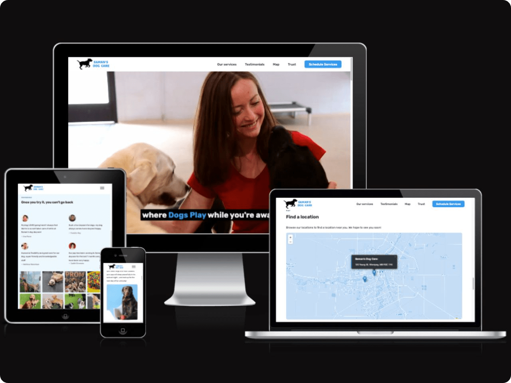

# Dog Daycare Landing Page

This is the repository for a responsive website for a dog daycare business that allows users to book dog care services in their neighborhood. The website was designed from scratch using Figma, implemented using HTML, CSS, and JavaScript, and bundled using Parcel.

## Features

- Interactive map to display dog care center locations.
- Responsive design for optimal viewing on any device.
- Functional contact form for booking dog care services.

### Author

Saman Fathnazarian - <a href="https://imsaman.com" target="_blank">https://imsaman.com</a>
